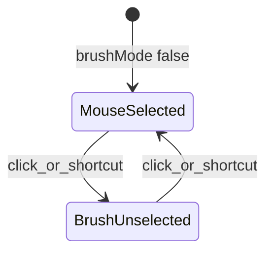

# 亮色工具栏、图标化与统一设置面板

## 目标对照

| 需求 | 方案 |
|------|------|
| 亮色背景 | [`content/toolbar.css`](d:\zqs1013\zqs1013_work\huabi\content\toolbar.css)、表格浮层、设置面板统一浅色主题 |
| 图标化工具栏 | 新增 [`content/icons.js`](d:\zqs1013\zqs1013_work\huabi\content\icons.js)（内联 SVG），按钮用 `<span class="huabi-icon">` |
| 模式单按钮 | 移除 `huabi-mode-mouse` / `huabi-mode-brush` 双按钮，改为 `#huabi-mode-toggle` 箭头图标；点击或 `toggleDrawMode` 快捷键切换 |
| 鼠标选中 / 画笔未选中 | `brushMode === false` 时按钮带 `huabi-active-tool`；`brushMode === true` 时不选中 |
| 设置集中 | 工具栏仅保留「设置」齿轮；颜色 3 槽、取色器、线宽、荧光笔透明度、快捷键、表格行列等移入 [`content/settings-panel`](d:\zqs1013\zqs1013_work\huabi\content\) |
| 橡皮擦 / 关闭 | 按你的选择：**工具栏增加**橡皮擦、关闭标注图标 |

---

## 工具栏布局（新）

```text
[拖动手柄] | [模式·箭头] | pen1 pen2 hl1 hl2 | line rect table eraser |
| undo redo | clear hide save | [设置] | [关闭]
```

- **从工具栏移除**：3 色块、取色器、粗细滑块、`huabi-style-hint` 文案（形状跟随画笔在设置里说明即可）
- **画笔 1/2 图标**：笔形 SVG + 底部色条仍用 `--pen-color`（读 profile，不在栏上改色）
- **关闭** `#huabi-close`：保留，结束标注会话（与现逻辑一致）

---

## 1. 亮色主题（CSS 变量）

在 [`content/toolbar.css`](d:\zqs1013\zqs1013_work\huabi\content\toolbar.css) 顶部定义：

```css
#huabi-toolbar {
  --hb-bg: rgba(255, 255, 255, 0.96);
  --hb-fg: #323130;
  --hb-border: #edebe9;
  --hb-hover: #f3f2f1;
  --hb-active: #deecf9;
  --hb-active-fg: #0078d4;
  background: var(--hb-bg);
  color: var(--hb-fg);
  border: 1px solid var(--hb-border);
  box-shadow: 0 2px 12px rgba(0, 0, 0, 0.12);
}
```

同步更新 [`#huabi-table-panel`](d:\zqs1013\zqs1013_work\huabi\content\toolbar.css)、新建 `#huabi-settings-panel` 为同色；分隔线、swatch 边框改为深色描边以适配浅底。

---

## 2. 图标资源（[`content/icons.js`](d:\zqs1013\zqs1013_work\huabi\content\icons.js)）

导出 `HuabiIcons.get(name)` 返回 SVG 字符串，`currentColor` 填色以随主题变色。

| name | 用途 |
|------|------|
| `modePointer` | 模式切换（箭头/指针） |
| `pen` | 画笔 1/2（配合色条区分） |
| `highlighter` | 荧光笔 1/2 |
| `line` `rect` `table` | 形状 |
| `eraser` | 橡皮 |
| `undo` `redo` | 撤销 / 恢复 |
| `clear` | 全部清除 |
| `eye` `eyeOff` | 隐藏 / 显示笔记（按 `notesHidden` 切换） |
| `save` | 导出 PNG |
| `settings` | 打开设置面板 |
| `close` | 关闭标注 |

[`manifest.json`](d:\zqs1013\zqs1013_work\huabi\manifest.json) 的 `content_scripts[].js` 增加：`icons.js` → `settings-panel.js` → `overlay.js`（顺序在 overlay 前）。

---

## 3. 模式单按钮逻辑（[`content/overlay.js`](d:\zqs1013\zqs1013_work\huabi\content\overlay.js)）

- 删除 `#huabi-mode-mouse`、`#huabi-mode-brush` 及各自 click 绑定
- 新增 `#huabi-mode-toggle`：`click` → `toggleBrushMode()`
- `applyBrushModeUI()` 改为：

```javascript
const btn = this.toolbar.querySelector("#huabi-mode-toggle");
btn.classList.toggle("huabi-active-tool", !this.brushMode); // 鼠标=选中
btn.title = this.brushMode ? "画笔模式（点击切换为鼠标）" : "鼠标模式（点击切换为画笔）";
```

- `setActive(true)` 仍默认 `brushMode = false`
- 键盘 `toggleDrawMode` 逻辑不变



---

## 4. 页内设置面板

### 新建文件

- [`content/settings-panel.css`](d:\zqs1013\zqs1013_work\huabi\content\settings-panel.css)
- [`content/settings-panel.js`](d:\zqs1013\zqs1013_work\huabi\content\settings-panel.js) — 构建 DOM、绑定表单、读写 `huabi_settings`

### 行为

- 点击工具栏「设置」→ 显示/隐藏 `#huabi-settings-panel`（固定于工具栏下方或屏幕居中模态，浅色卡片）
- 内容区块（与现 [`options/options.js`](d:\zqs1013\zqs1013_work\huabi\options\options.js) 合并逻辑，抽公共函数到 [`content/settings-form.js`](d:\zqs1013\zqs1013_work\huabi\content\settings-form.js) 供 options 页复用，避免双份维护）：
  1. **快捷键**：现有 `SHORTCUT_ACTIONS` 列表 + 录制
  2. **画笔 1 / 2**：3 保存色 + 自定义色 + 线宽
  3. **荧光笔 1 / 2**：3 保存色 + 自定义色 + 线宽 + **透明度滑块**（`highlightAlpha` 0.2–0.8）
  4. **橡皮擦**：线宽
  5. **表格工具**：行 / 列（从工具栏 `#huabi-table-panel` 迁入，选表格工具时可在设置里改，或设置里常驻）
- 「保存」→ `S.saveSettings()` + `RELOAD_SETTINGS` 广播 + `syncToolbarFromTool()` / `_updatePenButtonColors()`
- 点击面板外或 Esc 关闭

### Options 页

[`options/options.html`](d:\zqs1013\zqs1013_work\huabi\options\options.html) 改为引用同一 `settings-form.js`，或保留为「在标签页中打开完整设置」的镜像；[`popup/popup.html`](d:\zqs1013\zqs1013_work\huabi\popup\popup.html) 仅保留「开启/关闭标注」+ 链接「在标签页打开设置」（`chrome.runtime.openOptionsPage`）。

---

## 5. overlay.js 改动摘要

| 区域 | 变更 |
|------|------|
| `_buildToolbar` | 图标按钮 + 设置 + 关闭；无 color/width 控件 |
| `_bindToolbarActions` | 移除色块/取色器/线宽监听；模式单按钮；`#huabi-open-settings` |
| `syncToolbarFromTool` | 仅更新工具选中态、橡皮时无需色板；隐藏笔记图标 `eye`/`eyeOff` |
| `init` | 创建 `SettingsPanel` 实例挂载到 `#huabi-root` |
| 表格 | 移除独立 `#huabi-table-panel` 或改为设置面板内字段；`engine.tableRows/Cols` 仍从 settings 读 |

---

## 6. 数据结构（[`content/settings.js`](d:\zqs1013\zqs1013_work\huabi\content\settings.js)）

可选增加 `tableRows` / `tableCols` 到 `huabi_settings` 根级或 `toolProfiles.table`，默认 3×3；加载时写入 `engine`。

荧光笔透明度 UI 绑定现有 `highlightAlpha` 字段，默认 pen1 黑 / pen2 红等保持不变。

---

## 7. 验证清单

- [ ] 工具栏浅底、深字、选中态清晰
- [ ] 所有列出的工具均为 SVG 图标，无 emoji 文案按钮
- [ ] 默认进入标注为鼠标模式，模式按钮为选中；点一次变画笔（按钮不选中），再点回鼠标
- [ ] 空格（或自定义）与模式按钮行为一致
- [ ] 工具栏无颜色/粗细控件；在设置面板修改后笔迹与色条即时更新
- [ ] 荧光笔透明度在设置可调且影响绘制
- [ ] 橡皮擦、关闭标注在工具栏可用
- [ ] 选项页/弹窗与页内设置数据一致
