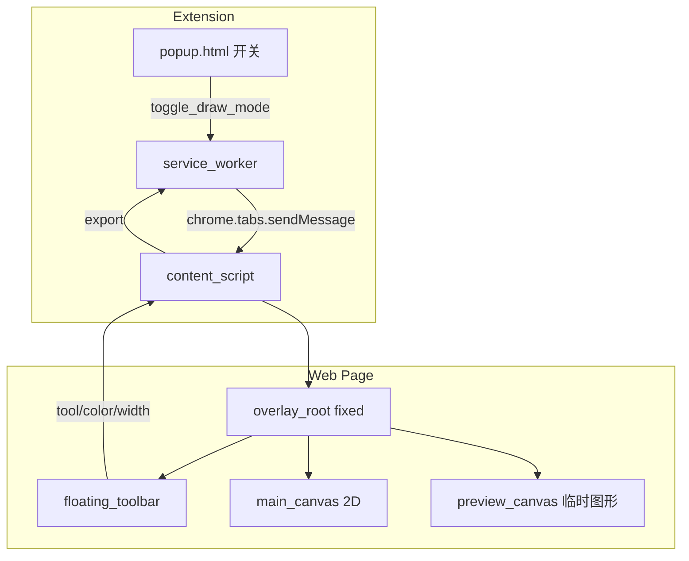

# 浏览器画笔插件技术方案

## 目标与约束

- **平台**：Chrome、Edge（共用 Chromium 扩展，Manifest V3）
- **交互**：页面内**悬浮工具栏**（可拖拽），点击扩展图标或快捷键进入/退出「标注模式」
- **持久化**：**不自动保存**；关闭标注模式或刷新页面即清空；提供**导出 PNG**（可选后续加 SVG）
- **项目目录**：当前工作区 [`huabi`](d:\zqs1013\zqs1013_work\huabi) 为空，建议按下方结构初始化

## 整体架构



| 模块 | 职责 |
|------|------|
| `manifest.json` | MV3 声明、权限、`content_scripts`、快捷键 |
| `background/service-worker.js` | 转发消息、管理 tab 级「是否在标注」状态 |
| `content/overlay.js` | 创建/销毁 overlay、事件路由、绘制逻辑、导出 |
| `content/toolbar.css` + 内联 HTML | 悬浮工具栏 UI |
| `popup/popup.html` | 一键开启标注、设置默认颜色/线宽（`chrome.storage.sync`） |

## 推荐目录结构

```
huabi/
├── manifest.json
├── background/
│   └── service-worker.js
├── content/
│   ├── overlay.js          # 核心绘制引擎
│   ├── toolbar.css
│   └── inject.css          # overlay 全屏样式
├── popup/
│   ├── popup.html
│   ├── popup.js
│   └── popup.css
├── icons/                  # 16/48/128
└── README.md               # 加载未打包扩展说明
```

## 核心技术选型

| 决策 | 选择 | 理由 |
|------|------|------|
| 渲染 | **双 Canvas**（主层 + 预览层） | 自由笔迹与已确认图形性能好；预览层画「拖拽中」的线/矩形/表格框，mouseup 后合并到主层 |
| 框架 | **原生 JS**（无 React） | 扩展 content script 体积小、注入快；逻辑集中在单文件便于维护 |
| 荧光笔 | 主层 `globalAlpha` + `globalCompositeOperation = 'multiply'`（或 `source-over` + 低 alpha） | 模拟半透明高亮；线宽 12–24px |
| 表格 | 工具态下弹**小面板**输入行/列，拖拽定外框，按行列画线 | 比手绘表格规整 |
| 导出 | `canvas.toDataURL('image/png')` + `<a download>` | 与「不持久化」一致；可 `merge` 页面截图需 `activeTab` + `captureVisibleTab`（二期） |

**暂不引入** Fabric.js/Konva：首版功能以 raster 为主，依赖少；若后续需要「选中/拖动已画图形」再迁到 Konva。

## 页面 overlay 设计

1. **注入时机**：`content_scripts` 在 `document_idle` 注入；默认 overlay **隐藏**，避免影响正常浏览。
2. **DOM 结构**（`z-index: 2147483646`）：
   - `#huabi-root`：`position: fixed; inset: 0; pointer-events: none`（关闭时）
   - 标注模式：`pointer-events: auto`，`cursor: crosshair`
   - `#huabi-canvas`（主层）、`#huabi-preview`（预览层）
   - `#huabi-toolbar`（可拖拽，`pointer-events: auto`）
3. **退出标注**：隐藏 overlay、清空两层 canvas、`pointer-events: none` 交还给页面。

## 工具与绘制状态机

统一 `DrawingEngine` 类，维护：

- `tool`: `pen | line | rect | table | highlighter | eraser`（橡皮擦建议首版带上）
- `color`, `lineWidth`, `isDrawing`
- `history[]`：每步 `ImageData` 快照，支持 **Undo/Redo**（约 20–30 步，控制内存）

| 工具 | 交互 | 实现要点 |
|------|------|----------|
| 自由绘制 `pen` | mousedown → mousemove 连线 → mouseup | `lineTo` + `lineCap round` |
| 荧光笔 `highlighter` | 同 pen | `alpha 0.35`，`lineWidth` 更大，`multiply` |
| 直线 `line` | 按下起点 → 移动预览 → 松开落笔 | 预览层 `clearRect` + `strokeLine`；mouseup 画到主层 |
| 矩形 `rect` | 同上 | `strokeRect`；可选 Shift 约束正方形（二期） |
| 表格 `table` | 选行列 → 拖拽外框 → 松开 | 根据外框均分画 `(cols+1)+(rows+1)` 条线 |
| 橡皮擦 `eraser` | 同 pen | `globalCompositeOperation = 'destination-out'` |

**坐标**：统一用 `getBoundingClientRect()` + `clientX/Y`，并处理 `devicePixelRatio` 避免高清屏模糊：

```javascript
const dpr = window.devicePixelRatio || 1;
canvas.width = window.innerWidth * dpr;
canvas.height = window.innerHeight * dpr;
ctx.scale(dpr, dpr);
```

## 悬浮工具栏 UI

- 横向图标条：工具切换 | 色块（预设 8 色 + 原生 `<input type="color">`）| 线宽滑块 | 撤销/重做 | 清空 | 导出 | 关闭
- **拖拽**：toolbar 上 `mousedown` 记录偏移，`mousemove` 更新 `top/left`（限制在视口内）
- **样式**：`inject.css` + `toolbar.css`，深色半透明背景，与页面内容区分

## manifest.json 要点

```json
{
  "manifest_version": 3,
  "name": "Huabi 网页画笔",
  "version": "1.0.0",
  "permissions": ["storage", "activeTab"],
  "action": { "default_popup": "popup/popup.html" },
  "background": { "service_worker": "background/service-worker.js" },
  "content_scripts": [{
    "matches": ["<all_urls>"],
    "js": ["content/overlay.js"],
    "css": ["content/inject.css", "content/toolbar.css"],
    "run_at": "document_idle"
  }],
  "commands": {
    "toggle-draw": {
      "suggested_key": { "default": "Alt+Shift+D" },
      "description": "切换标注模式"
    }
  }
}
```

- `<all_urls>`：任意页可标注；若上架商店需准备隐私说明（不采集页面内容，仅本地 canvas）。
- `storage`：仅存用户默认颜色/线宽/快捷键偏好，**不存标注内容**（符合 export_only）。

## 消息协议（popup / 快捷键 ↔ content）

| 消息 type | 方向 | 作用 |
|-----------|------|------|
| `TOGGLE_DRAW_MODE` | → content | 显示/隐藏 overlay |
| `GET_STATE` | ↔ | 查询当前是否在标注 |
| `SET_DEFAULTS` | → content | 应用 storage 中的 color/width |
| `EXPORT_PNG` | content 内完成 | 主 canvas `toDataURL` 触发下载 |

`service-worker` 在 `chrome.commands.onCommand` 与 `action.onClicked`（若不用 popup）里向当前 tab `sendMessage`。

## 导出 PNG 流程

1. 用户点「导出」
2. 可选：暂时隐藏 toolbar 再截图（避免工具栏入画）
3. `const url = mainCanvas.toDataURL('image/png')`
4. 创建 `a[download=huabi-{timestamp}.png]` 并 click

**说明**：导出的是**标注层**透明底 PNG；若需要「网页+标注」合成图，二期用 `chrome.tabs.captureVisibleTab` 与标注层 `drawImage` 合成。

## 兼容性与限制

- **iframe / PDF / chrome://**：content script 无法注入，需文档说明
- **滚动页面**：overlay `fixed` 覆盖视口；长页标注仅当前视口（首版）；二期可监听 scroll 同步或改用 `absolute` + 文档高度 canvas
- **Edge**：与 Chrome 相同加载「扩展程序」→ 开发者模式 → 加载已解压的 [`huabi`](d:\zqs1013\zqs1013_work\huabi)

## 实施阶段（建议顺序）

### 阶段 1 — 骨架（约 1 天）
- `manifest.json`、service worker、popup 开关
- overlay 显示/隐藏、双 canvas、DPR 适配
- 自由绘制 + 颜色/线宽

### 阶段 2 — 几何与荧光（约 1 天）
- 直线、矩形（预览层）
- 荧光笔、橡皮擦
- Undo/Redo

### 阶段 3 — 表格与工具栏（约 1 天）
- 表格工具（行列输入 + 拖拽）
- 完整悬浮工具栏、拖拽、快捷键

### 阶段 4 — 导出与打磨（约 0.5 天）
- PNG 导出、清空、关闭模式
- 特殊页面与性能测试（大画布重绘用 `putImageData` 而非重复路径）

### 可选二期
- 导出含网页背景的合成图
- SVG 导出（矢量线/矩形）
- 全文档高度 canvas + 滚动同步
- 形状选中/移动（引入 Konva）

## 验证清单

- [ ] Chrome/Edge 加载未打包扩展无报错
- [ ] 任意 https 页开启标注，pen/line/rect/table/highlighter 正常
- [ ] 撤销/重做、清空、关闭后页面可正常点击
- [ ] 导出 PNG 透明底、线条清晰（Retina 屏无糊）
- [ ] 刷新后标注消失（符合 export_only）
