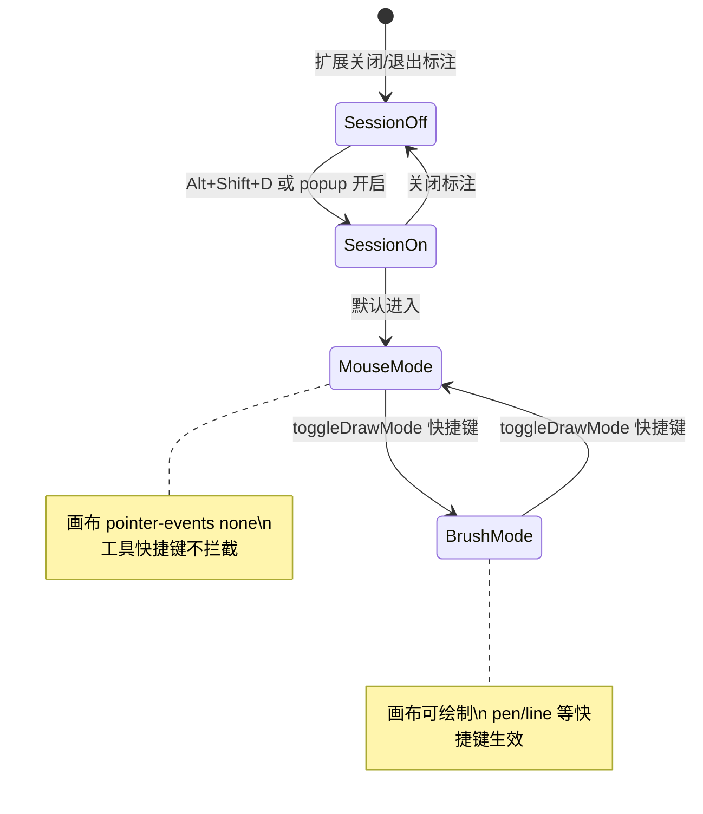
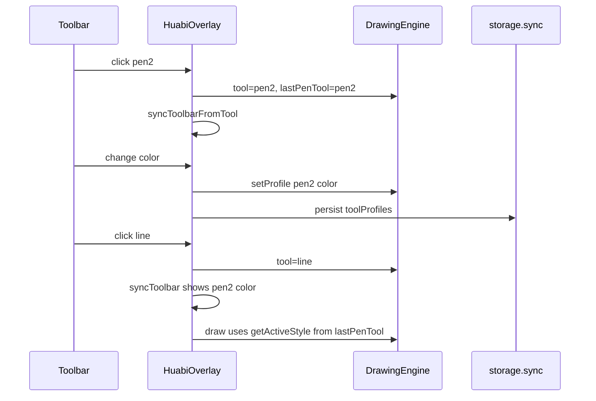

# Huabi 画笔工具增强计划

## 需求对照

| 需求 | 方案 |
|------|------|
| 每种笔独立粗细/颜色 | `toolProfiles` 按工具 ID 存储，切换工具时同步工具栏色块/滑块 |
| 两种颜色画笔 | `pen1`、`pen2` 两个工具按钮，各自 profile |
| 两种颜色荧光笔 | `highlighter1`、`highlighter2` |
| 直线/矩形/表格继承画笔色 | 绘制时用 `lastPenTool`（`pen1`/`pen2`）的 `color` + `lineWidth` |
| 清空无确认、可撤销 | `clear()` 先 `pushHistory()` 再 `clearRect`，**不再** `history = []` |
| 隐藏所有笔记 | 切换 `notesHidden`，仅隐藏 canvas 层，数据保留 |
| 每工具自定义快捷键 | 标注会话内 `keydown` + 选项页录制；**仅画笔模式**下生效 |
| 鼠标/画笔模式切换 | 自定义快捷键 `toggleDrawMode`；鼠标模式可正常操作网页，画笔模式才可绘制且工具快捷键生效 |

### 两层模式（重要）



| 层级 | 含义 | 进入方式 |
|------|------|----------|
| **标注会话**（Session） | overlay 显示，笔迹保留 | `toggle-draw` / popup「开启标注」 |
| **鼠标模式** | 穿透点击网页，不绘制 | 进入会话时默认；或 `toggleDrawMode` |
| **画笔模式** | 在 canvas 上绘制；工具快捷键生效 | `toggleDrawMode`（选项页可自定义） |

快捷键实现：**仅 content script 监听**。`toggle-draw` 仍负责整段标注会话开关；`toggleDrawMode` 在会话内切换鼠标/画笔，且**始终可触发**（不论当前是鼠标还是画笔模式）。

---

## 工具模型重构

### 工具 ID 一览

```
pen1, pen2, highlighter1, highlighter2, line, rect, table, eraser
```

### 配置结构（`chrome.storage.sync`）

```javascript
// key: huabi_settings
{
  toolProfiles: {
    pen1:           { color: "#e53935", lineWidth: 3 },
    pen2:           { color: "#1e88e5", lineWidth: 3 },
    highlighter1:   { color: "#fdd835", lineWidth: 8 },
    highlighter2:   { color: "#43a047", lineWidth: 8 },
    eraser:         { lineWidth: 12 }  // 无颜色
  },
  lastPenTool: "pen1",
  shortcuts: {
    pen1: "KeyP",
    pen2: "KeyShift+P",
    highlighter1: "KeyH",
    // ... 见下方默认表
    toggleVisibility: "KeyV",
    undo: "Control+z",
    redo: "Control+Shift+z",
    clear: "",
    export: "Control+s",
    toggleDrawMode: "Space"   // 鼠标 ↔ 画笔（选项页可改）
  }
}
```

迁移：读取时若仅有旧 key `huabi_defaults`，合并进 `pen1` 后删除旧 key。

### DrawingEngine 改造（[`content/overlay.js`](content/overlay.js)）

- 删除全局 `this.color` / `this.lineWidth` 作为唯一来源
- 新增方法：
  - `getProfile(toolId)` / `setProfile(toolId, partial)`
  - `isPenTool(id)` → `pen1|pen2`
  - `isHighlighterTool(id)` → `highlighter1|highlighter2`
  - `isShapeTool(id)` → `line|rect|table`
  - `getActiveStyle()`：笔/荧光笔/橡皮用当前 `tool` 的 profile；形状工具用 `toolProfiles[lastPenTool]`
- `applyStrokeStyle` / `applyFillStrokeStyle` 改为基于 `getActiveStyle()` 和当前 `tool` 类型
- 指针事件里 `pen|highlighter` 判断扩展为 4 个 ID（可用 helper `isFreehandTool(tool)`）

**形状继承逻辑**：

```javascript
getActiveStyle() {
  if (isShapeTool(this.tool)) {
    return this.getProfile(this.lastPenTool);
  }
  return this.getProfile(this.tool);
}
```

切换 `pen1`/`pen2` 时更新 `lastPenTool`；在形状工具下改颜色/线宽 → 写入 `lastPenTool` 的 profile（工具栏旁显示小字「跟随画笔1」）。

---

## 清空可撤销

当前问题（[`overlay.js` L106-113, L515-517`](content/overlay.js)）：

- `clear()` 清空 canvas **且** 丢弃 `history`/`redoStack`
- 清空前有 `confirm()`

修改为：

```javascript
clear() {
  this.pushHistory();           // 快照含当前笔迹
  this.mainCtx.clearRect(...);
  this.clearPreview();
  // 不重置 history / redoStack
}
```

移除 `confirm()`。用户点撤销可 `putImageData` 恢复清空前的快照。

---

## 鼠标模式 / 画笔模式

### 状态（`HuabiOverlay`）

- `active`：标注会话是否开启（现有逻辑）
- `brushMode`：`true` = 画笔模式，`false` = 鼠标模式（默认 `false`）

### 行为

| 模式 | canvas 层 | 光标 | 工具快捷键 |
|------|-----------|------|------------|
| 鼠标 | `.huabi-canvas-wrap` 设 `pointer-events: none` | 默认箭头 | **不处理**（除 `toggleDrawMode` 本身） |
| 画笔 | canvas 接收指针事件 | `crosshair`（橡皮擦时 `cell`） | 全部生效 |

[`content/inject.css`](content/inject.css) 补充：

```css
#huabi-root.huabi-active.huabi-mouse-mode .huabi-canvas-wrap {
  pointer-events: none;
  cursor: default;
}
#huabi-root.huabi-active.huabi-brush-mode .huabi-canvas-wrap {
  pointer-events: auto;
}
#huabi-root.huabi-active.huabi-brush-mode.huabi-drawing {
  cursor: crosshair;
}
```

- 工具栏新增「鼠标 / 画笔」切换按钮（与快捷键等价），当前模式高亮
- `setActive(true)` 时默认 `brushMode = false`（先进鼠标模式，避免挡住网页操作）
- `setActive(false)` 时重置状态；**不再**在关闭时 `engine.clear()`（与「隐藏笔记」一致，笔迹随刷新消失即可；若需保留关闭前笔迹可维持 canvas 不清空直至刷新）

### `toggleDrawMode` 快捷键

- 存于 `shortcuts.toggleDrawMode`，选项页单独一行「切换鼠标/画笔」
- 仅在 `active === true` 时监听；触发时 `brushMode = !brushMode` 并更新 UI
- 若当前在工具栏 `input` 内聚焦，仍允许触发（与工具键不同，避免无法退出录制态）

---

## 隐藏笔记按钮

- `HuabiOverlay.notesHidden = false`
- 工具栏新增按钮 `#huabi-toggle-visibility`（图标/文案：隐藏 / 显示）
- 切换时对 `.huabi-canvas-wrap` 加 class `huabi-notes-hidden`（[`content/inject.css`](content/inject.css)）：

```css
.huabi-canvas-wrap.huabi-notes-hidden {
  visibility: hidden;
  pointer-events: none;
}
```

- 工具栏保持可见、可操作；导出 PNG 时仍导出完整 canvas（含隐藏状态下的笔迹，与「隐藏仅视觉」一致）
- 默认快捷键 `KeyV`（可在选项页改）

---

## 工具栏 UI 调整

[`_buildToolbar`](content/overlay.js) 变更：

| 原控件 | 新控件 |
|--------|--------|
| 单「画笔」 | `pen1`、`pen2`（按钮底部色条显示各自 color） |
| 单「荧光笔」 | `highlighter1`、`highlighter2` |
| 全局色板 + color picker | 保留；修改时写入**当前工具** profile（形状工具写入 `lastPenTool`） |
| 全局线宽滑块 | 同上 |
| 清空 | 无 confirm |
| 新增 | 「隐藏笔记」按钮 |
| 新增 | 「鼠标 / 画笔」模式切换按钮 |

切换工具时调用 `syncToolbarFromTool()`：更新 color picker、滑块、色板高亮、形状工具提示文案。切换到形状/笔工具时**不自动**进入画笔模式（仍由用户按 `toggleDrawMode` 决定）。

[`popup/popup.html`](popup/popup.html)：移除「默认颜色/线宽」（改由 per-tool profile）；增加「快捷键设置」链接打开 options 页；保留「开启标注」与 `toggle-draw` 说明。

---

## 快捷键系统（content only）

### 新增文件

- [`options/options.html`](options/options.html) + [`options/options.js`](options/options.js) + [`options/options.css`](options/options.css)
- [`content/shortcuts.js`](content/shortcuts.js)（或合并进 overlay：解析/匹配/录制工具函数）

[`manifest.json`](manifest.json) 增加：

```json
"options_ui": {
  "page": "options/options.html",
  "open_in_tab": true
}
```

### 录制流程（选项页）

- 每个工具一行：名称 + 当前快捷键显示 +「设置」按钮
- 点击「设置」进入录制态，`keydown` 捕获组合键 → 规范化字符串（如 `Control+Shift+z`）
- 支持「清除」绑定；冲突检测（同一组合不能绑两个工具）
- 保存到 `huabi_settings.shortcuts`

### 页面内监听（标注会话）

在 `HuabiOverlay.setActive(true)` 时 `window.addEventListener('keydown', handler, true)`，关闭时移除。

**分发逻辑**：

1. 先匹配 `shortcuts.toggleDrawMode` → 切换 `brushMode`，`preventDefault`（会话内始终可用）
2. 若 `brushMode === false` → **return**（不处理 pen/line/undo 等）
3. 若焦点在 `input/textarea`（表格行列等）→ 不拦截工具键（`toggleDrawMode` 除外）
4. 匹配其余 `shortcuts` → `switchTool` / `undo` / `clear` / `toggleNotesVisibility` / `exportPng`

默认快捷键建议（均可改）：

| 工具/动作 | 默认 |
|-----------|------|
| **切换鼠标/画笔** | `Space` |
| pen1 | `KeyP` |
| pen2 | `KeyShift+P` |
| highlighter1 | `KeyH` |
| highlighter2 | `KeyShift+H` |
| line | `KeyL` |
| rect | `KeyR` |
| table | `KeyT` |
| eraser | `KeyE` |
| 隐藏笔记 | `KeyV` |
| 撤销/重做 | `Control+z` / `Control+Shift+z` |

（单独字母键仅在**画笔模式**下由 Huabi 消费；鼠标模式下网页可正常接收按键。`Space` 作默认切换键时，画笔模式下按空格会切换回鼠标模式而非输入空格，可在选项页改为如 `` ` `` 或 `F2`。）

### Service Worker

[`background/service-worker.js`](background/service-worker.js) 仅保留 `toggle-draw` 转发；**不**为各工具新增 manifest commands。

---

## 数据流（切换工具）



---

## 涉及文件清单

| 文件 | 变更 |
|------|------|
| [`content/overlay.js`](content/overlay.js) | ToolProfile、getActiveStyle、clear/隐藏、工具栏、键盘监听 |
| [`content/inject.css`](content/inject.css) | `huabi-notes-hidden` |
| [`content/toolbar.css`](content/toolbar.css) | 双笔按钮色条、形状提示、工具栏略加宽 |
| [`manifest.json`](manifest.json) | `options_ui` |
| [`popup/popup.html`](popup/popup.html) + [`popup/popup.js`](popup/popup.js) | 精简 + 跳转 options |
| [`options/*`](options/) | 新建快捷键与 profile 总览 |
| 可选 [`content/settings.js`](content/settings.js) | 读写 storage、默认值、迁移 |

---

## 验证清单

- [ ] pen1/pen2、hl1/hl2 各自颜色线宽切换后仍保持
- [ ] 直线/矩形/表格颜色与**最近使用的画笔**一致；切换 pen1/pen2 后再画形状随之变化
- [ ] 清空无弹窗，撤销可恢复全部笔迹
- [ ] 隐藏笔记后页面不可画在隐藏层上，显示后笔迹完整；导出含笔迹
- [ ] `toggleDrawMode` 在标注会话内切换鼠标/画笔；鼠标模式可点击网页，画笔模式可绘制
- [ ] 工具快捷键（pen1/undo 等）仅在画笔模式生效；`toggleDrawMode` 两种模式均可用
- [ ] 选项页录制快捷键后生效；退出标注会话后不拦截网页按键
- [ ] 旧 `huabi_defaults` 迁移到 pen1 无报错
