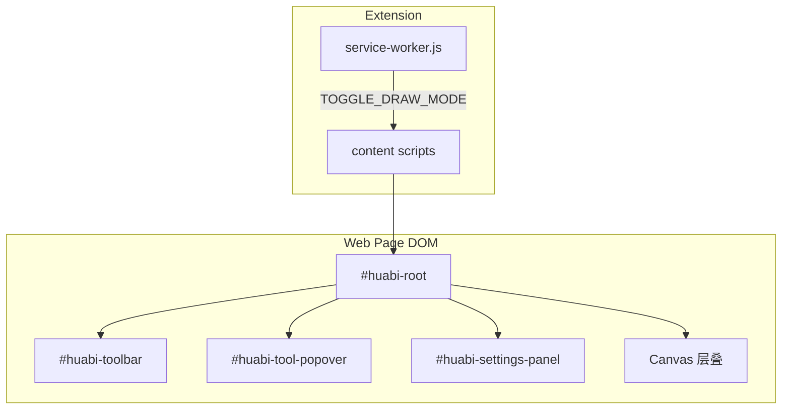

# 晨曦画笔（huabi）— 项目索引

> 供 AI 助手与开发者快速理解代码库。**修改前先读本文 + 相关源文件。**
>
> 版本以 `manifest.json` 为准（当前 **2.0.0**）。开发者：邹庆松 · 18603919370

---

## 1. 项目是什么

**晨曦画笔** 是 Chrome / Edge（Manifest V3）浏览器扩展：在任意网页上注入透明 Canvas 层，提供画笔、荧光笔、几何形状、表格、坐标系、文字等标注能力。

- **技术栈**：原生 JavaScript（无 React/Vue）、Canvas 2D、Chrome Extension APIs
- **存储**：`chrome.storage` 保存用户偏好；**标注内容仅存内存**，刷新即失
- **权限**：`storage`、`activeTab`；内容脚本匹配 `<all_urls>`

---

## 2. 目录与职责

```
huabi/
├── manifest.json              # 扩展清单；版本号唯一权威来源
├── INDEX.md                   # 本文件（项目索引）
├── README.md                  # 安装与 npm 命令
├── docs/用户指南.md            # 面向终端用户
├── background/
│   └── service-worker.js      # 点击图标开关标注、Alt+1、字体 buffer 备用读取
├── content/                   # 核心：注入页面的全部逻辑
│   ├── overlay.js             # ★ 主入口：HuabiOverlay + DrawingEngine（~4000 行）
│   ├── settings.js            # ★ 设置模型、默认值、storage、工具分类、压感、字体
│   ├── settings-form.js       # 设置表单 UI（选项页与工具栏设置面板共用）
│   ├── settings-panel.js      # 工具栏旁浮层设置面板
│   ├── shortcuts.js           # 快捷键解析、冲突检测、录制
│   ├── cursors.js             # 画笔/橡皮/荧光笔软件光标 SVG
│   ├── icons.js + icons.generated.js  # 工具栏图标
│   ├── inject.css             # 画布层、模式切换 pointer-events、文字编辑遮罩
│   ├── toolbar.css            # 工具栏、▾ popover、快捷键 tooltip
│   ├── settings-panel.css     # 设置面板样式
│   └── fonts/                 # 自定义字体 + 自动生成 manifest
├── options/                   # chrome://extensions → 扩展选项（独立标签页）
├── popup/                     # 弹窗 UI（可选，当前由 action 直接 toggle）
├── icons/                     # 扩展图标 PNG
└── scripts/                   # 构建：icons、fonts、pack
```

---

## 3. 运行时架构



### 3.1 内容脚本加载顺序（manifest `content_scripts.js`）

1. `fonts.registry.generated.js` — 字体注册表
2. `settings.js` → `window.HuabiSettings`
3. `shortcuts.js` → `window.HuabiShortcuts`
4. `icons.generated.js` + `icons.js` → `window.HuabiIcons`
5. `cursors.js` → `window.HuabiCursors`
6. `settings-form.js` → `window.HuabiSettingsForm`
7. `settings-panel.js` → `window.HuabiSettingsPanel`
8. `overlay.js` — 初始化 `HuabiOverlay`，挂载 `#huabi-root`

单页防重复：`window.__huabiInitialized`。

### 3.2 Canvas 层（自下而上）

| 层 ID | 内容 |
|--------|------|
| `#huabi-highlight` | 荧光笔（multiply 混合） |
| `#huabi-main` | 自由笔划、橡皮擦结果 |
| `#huabi-shape` | 矢量形状（`shapeItems` 渲染） |
| `#huabi-text` | 矢量文字（`textItems` 渲染） |
| `#huabi-preview` | 拖拽预览、选中框、手柄 |

历史撤销：整层 `ImageData` 快照 + `shapeItems` / `textItems` 数组（见 `DrawingEngine._captureHistorySnap`）。

### 3.3 核心类

| 类 | 文件 | 职责 |
|----|------|------|
| `DrawingEngine` | overlay.js | 绑制、擦除、形状/文字/坐标系/表格、命中检测、undo/redo |
| `HuabiOverlay` | overlay.js | UI：工具栏、popover、模式切换、事件、导出 PNG、软件光标 |

---

## 4. 工具与数据模型

### 4.1 工具 ID（`settings.js` / `engine.tool`）

| 类别 | ID |
|------|-----|
| 画笔 | `pen1`, `pen2` |
| 荧光笔 | `highlighter1`, `highlighter2` |
| 形状 | `line`, `rect`, `circle`, `arrowLine`, `table`, `axes` |
| 其他 | `text`, `eraser` |

辅助函数：`isPenTool`, `isHighlighterTool`, `isShapeTool`, `isEraserTool`, `isTextTool`, `profileTargetTool` 等均在 `HuabiSettings`。

### 4.2 工具配置（`toolProfiles`）

每工具：`color`, `lineWidth`, `savedColors`（最近 3 色）, 荧光笔 `highlightAlpha`, 矩形 `rectMode`/`fillAlpha` 等。  
默认值：`DEFAULT_TOOL_PROFILES` in `settings.js`。

### 4.3 矢量对象

- **`shapeItems[]`**：直线、矩形、圆、箭头线、表格、坐标系；可选中、拖动、缩放（手柄）
- **`textItems[]`**：文字块；单击选中、双击编辑、Delete 删除

旧版画进 `#huabi-main` 的位图文字/形状**不可**再编辑。

### 4.4 用户设置（`chrome.storage` key: `huabi_settings`）

含：`toolProfiles`, `shortcuts`, `toolbarVisible`, `lastPenTool`, `textFontFamily`, `textFontSize`, `tableRows/Cols`, `coordTicks/Start/Step/Mode`, `arrowEnds`, **压感**（`pressureEnabled` 默认开）等。  
加载/规范化：`loadSettings` → `normalizeLoadedSettings`。

---

## 5. 交互模式

| 模式 | CSS class | 行为 |
|------|-----------|------|
| 标注关闭 | 无 `huabi-active` | 不显示 UI |
| 鼠标模式 | `huabi-mouse-mode` | 画布 `pointer-events: none`，可操作网页；可选中标注 |
| 画笔模式 | `huabi-brush-mode` | 画布可绘；`cursor: none` + `#huabi-cursor-follower` 软件光标 |

切换：`toggleBrushMode` / 空格快捷键。  
形状/文字用完可自动回鼠标模式（`requiresReclickAfterUse`）。  
画笔/荧光笔/橡皮用后保持当前工具（`keepsToolAfterUse`）。

---

## 6. UI 要点

### 6.1 工具栏（`HuabiOverlay._buildToolbar`）

- 工具按钮：`._toolBtn()` → `.huabi-tool-wrap` + 主按钮 + `.huabi-tool-caret`（▾）
- **▾ 样式 popover**：`#huabi-tool-popover`，`_openToolPopover` / `_toggleToolPopover`
- 画笔/荧光笔 **颜色**：popover 内 3 个最近色 + 自定义 color input（`pushRecentColor`）
- 已选中工具时 **再点图标** 也可 toggle popover
- caret 三角形 CSS 需 `!important` 边框，避免被 `#huabi-toolbar button { border: none }` 覆盖

### 6.2 设置

- **工具栏齿轮** → `HuabiSettingsPanel`（浮层）
- **扩展选项页** → `options/options.html` + 同一 `settings-form.js`
- 底部：立即保存（保存后关闭）、关闭、恢复默认快捷键
- 开发者介绍区块：姓名、电话、版本（读 manifest）

### 6.3 压感（数位板）

- `PointerEvent.pressure` + `getCoalescedEvents()`
- 默认开启；设置页「数位板压感」▾ 浮层配置
- 画笔/橡皮 **软件光标** 固定 1 倍；压感开启时 pen follower 用简化 SVG（无装饰线）

---

## 7. 消息与后台

| 消息 type | 方向 | 用途 |
|-----------|------|------|
| `TOGGLE_DRAW_MODE` | SW → content | 开关标注 |
| `DRAW_STATE_CHANGED` | content → SW | 同步 tab 状态 |
| `RELOAD_SETTINGS` | options → tabs | 设置变更后刷新 |
| `FETCH_FONT_BUFFER` | content → SW | 字体读取备用 |
| `FONTS_INDEX_UPDATED` | SW → tabs | 字体索引更新 |

---

## 8. 构建与发布

```bash
npm install          # prepare 会跑 fonts 索引
npm run fonts        # 扫描 content/fonts
npm run icons        # 生成 icons/*.png
npm run icons:toolbar # 生成 icons.generated.js
npm run pack         # dist/huabi-{version}.zip（不含字体二进制）
```

改 `content/iconfont/*.svg` 后跑 `icons:toolbar`。  
增删字体后跑 `fonts` 并 **重新加载扩展**。

---

## 9. 修改约定（给 AI）

1. **版本号**：只改 `manifest.json`，设置页自动显示；同步 `package.json` 与文档中的版本提及。
2. **大文件**：逻辑主要在 `overlay.js`；新功能先找是否已有类似实现（如矩形 popover 颜色 → 复用到 pen popover）。
3. **样式隔离**：设置面板/popover 内 checkbox、range 需 `#huabi-settings-panel` / `#huabi-tool-popover` 前缀，防宿主 CSS 覆盖。
4. **pointer-events**：鼠标模式依赖 `inject.css` 中 `.huabi-mouse-mode`；改交互时勿破坏 iframe 内编辑器聚焦。
5. **历史栈**：改 shape/text 时同步 `pushHistory` 与 `_captureHistorySnap`。
6. **不要**擅自 commit；用户未要求时不改 `docs/` 大段文案。
7. **语言**：用户沟通用简体中文。

---

## 10. v2.0 相对 1.x 的主要变化（摘要）

- 形状矢量层 + 选中/缩放/移动；实心矩形；箭头线、圆形
- 文字独立层 + 再编辑；表格行列号；坐标系第一象限模式
- 数位板压感；软件光标跟随
- 工具栏 ▾ 内配置颜色（最近 3 色）与线宽；颜色从设置页迁到 popover
- 设置页：压感 ▾ 折叠、关闭按钮、保存后关闭、开发者介绍
- 工具栏悬浮快捷键提示

---

## 11. 相关文档

| 文件 | 读者 |
|------|------|
| [docs/用户指南.md](docs/用户指南.md) | 终端用户 |
| [README.md](README.md) | 安装与 npm |
| [content/fonts/README.md](content/fonts/README.md) | 自定义字体 |
| [content/iconfont/README.md](content/iconfont/README.md) | 工具栏 SVG 图标 |

---

*本索引随 major 版本更新；细节以源码为准。*
